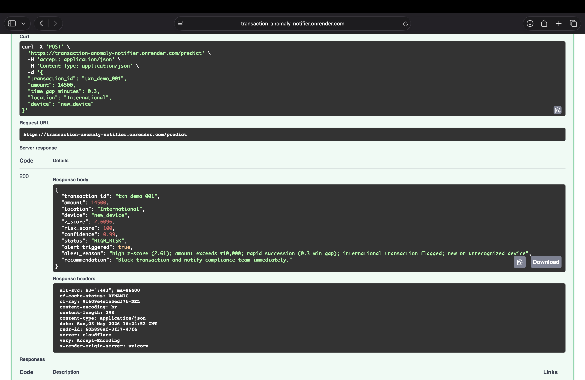
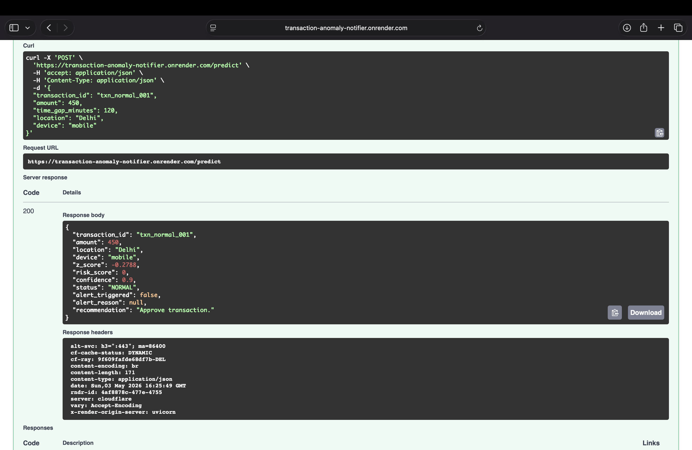

# Transaction Anomaly Notifier

> Real-time transaction fraud detection API with async alerting, batch scoring, PostgreSQL audit logging, and full CI/CD — built with Pine Labs' payments infrastructure in mind.

---

## 🔴 Live Demo

| What | Link |
|------|------|
| **Swagger UI** (try endpoints live) | [/docs](https://transaction-anomaly-notifier.onrender.com/docs) |
| **Health check** | [/health](https://transaction-anomaly-notifier.onrender.com/health) |
| **API base** | https://transaction-anomaly-notifier.onrender.com |

> ⚠️ Hosted on Render free tier — first request may take ~30 seconds to wake up. Subsequent requests are fast.

---

## Screenshots

### Swagger UI — interactive docs


### HIGH_RISK — 5 rules triggered, alert fired, confidence 0.99


### NORMAL — clean transaction, approved instantly


---

## Quick test (copy-paste into your terminal)

**Test a HIGH_RISK transaction:**
```bash
curl -X POST https://transaction-anomaly-notifier.onrender.com/predict \
  -H "Content-Type: application/json" \
  -d '{
    "transaction_id": "txn_001",
    "amount": 14500,
    "time_gap_minutes": 0.3,
    "location": "International",
    "device": "new_device"
  }'
```

**Expected response:**
```json
{
  "transaction_id": "txn_001",
  "amount": 14500,
  "location": "International",
  "device": "new_device",
  "z_score": 2.61,
  "risk_score": 100,
  "confidence": 0.99,
  "status": "HIGH_RISK",
  "alert_triggered": true,
  "alert_reason": "high z-score (2.61); amount exceeds ₹10,000; rapid succession (0.3 min gap); international transaction flagged; new or unrecognized device",
  "recommendation": "Block transaction and notify compliance team immediately."
}
```

**Test a NORMAL transaction:**
```bash
curl -X POST https://transaction-anomaly-notifier.onrender.com/predict \
  -H "Content-Type: application/json" \
  -d '{
    "transaction_id": "txn_002",
    "amount": 450,
    "time_gap_minutes": 120,
    "location": "Delhi",
    "device": "mobile"
  }'
```

---

## Postman Collection

Download and import [`postman_collection.json`](./postman_collection.json) into Postman to run all 7 sample requests instantly — no setup required.

---

## What This Does

Payment networks process millions of transactions per minute. A single undetected fraud event costs on average ₹40,000+. This system scores each transaction in **< 10 ms** using a multi-rule engine, persists audit logs to PostgreSQL, and dispatches async email + Slack alerts via Celery — without blocking the HTTP response.

---

## Tech Stack

| Layer | Technology |
|-------|------------|
| API | FastAPI + Uvicorn |
| Scoring Engine | NumPy / Pandas (z-score + rule-based) |
| Async Alerts | Celery + Redis |
| Database | PostgreSQL (psycopg2) |
| Testing | Pytest + pytest-cov (80%+ coverage enforced) |
| Containerisation | Docker + Docker Compose |
| CI/CD | GitHub Actions |
| Serverless | AWS Lambda + API Gateway |

---

## Project Structure

```
transaction-anomaly-notifier/
├── main.py                    ← FastAPI app — /predict, /batch-predict, /audit-logs
├── lambda_handler.py          ← AWS Lambda entry point (serverless deploy)
├── celery_worker.py           ← Async alert dispatcher (email + Slack)
├── transactions.csv           ← 1,000-row baseline dataset (10% injected anomalies)
├── requirements.txt           ← All dependencies with pinned versions
├── Dockerfile                 ← Docker build
├── docker-compose.yml         ← API + Celery worker + Postgres + Redis
├── .env.example               ← Environment variable template
├── postman_collection.json    ← 7 ready-to-run API requests
├── high_risk.png              ← Screenshot: HIGH_RISK prediction response
├── normal.png                 ← Screenshot: NORMAL prediction response
├── swagger.png                ← Screenshot: Swagger UI
├── tests/
│   └── test_api.py            ← 25 pytest tests — unit + integration + resilience
└── .github/
    └── workflows/
        └── ci.yml             ← GitHub Actions: test → lint → Docker build
```

---

## Quickstart (Local)

### Option A — Docker (recommended, zero config)

```bash
cp .env.example .env
docker compose up --build
```

All four services start: API on `:8000`, PostgreSQL on `:5432`, Redis on `:6379`, Celery worker.

Open **http://localhost:8000/docs** for Swagger UI.

### Option B — Python only

```bash
pip install -r requirements.txt
uvicorn main:app --reload
```

Open **http://localhost:8000/docs** for Swagger UI.

---

## API Reference

### `POST /predict`

Score a single transaction. Supports `location` and `device` for richer fraud signals.

**Request fields:**

| Field | Type | Required | Example |
|-------|------|----------|---------|
| `transaction_id` | string | No | `"txn_abc123"` |
| `amount` | float | **Yes** | `14500` |
| `time_gap_minutes` | float | No | `0.3` |
| `location` | string | No | `"Delhi"`, `"International"`, `"Unknown"` |
| `device` | string | No | `"mobile"`, `"desktop"`, `"new_device"`, `"pos"` |

**Response fields:**

| Field | Type | Example |
|-------|------|---------|
| `risk_score` | int 0–100 | `100` |
| `confidence` | float 0–1 | `0.99` |
| `status` | string | `HIGH_RISK` / `SUSPICIOUS` / `NORMAL` |
| `alert_triggered` | bool | `true` |
| `alert_reason` | string | lists every rule that fired |
| `recommendation` | string | action to take |

### `POST /batch-predict`

Score up to **100 transactions** in one request. Returns results + aggregate summary (`high_risk_count`, `alert_rate_pct`, `avg_risk_score`).

### `GET /audit-logs?status=HIGH_RISK&limit=20`

Recent scored transactions from PostgreSQL. Uses indexed columns for fast retrieval.

---

## Scoring Engine

Five independent rules → 0–100 risk score:

```
Rule 1 — Z-score      |z| > 3.0 → +50   |z| > 2.0 → +30   |z| > 1.5 → +15
Rule 2 — Value         > ₹10k  → +25    > ₹5k    → +10
Rule 3 — Velocity     gap < 1 min → +25  gap < 30% avg → +10
Rule 4 — Location     Unknown → +20     International → +15
Rule 5 — Device       new_device → +15
```

Alert fires when `risk_score ≥ 60` OR (`risk_score ≥ 30` AND 2+ rules fired).

Confidence is calculated from the number of rules that fired — more signals = higher confidence.

---

## Async Alert Architecture

```
POST /predict → compute_risk() → PostgreSQL
                      │
              alert_triggered?
                      ↓
            Celery task → Redis → Worker
                                   ├── SMTP email
                                   └── Slack webhook
```

API returns in **< 10 ms**. Alerts delivered async with 3-retry exponential back-off.

---

## Tests

```bash
pytest tests/ -v --cov=. --cov-report=term-missing
```

25 tests across: rule engine, endpoints, batch scoring, DB resilience. CI enforces ≥ 80% coverage.

---

## AWS Deployment

- **Lambda**: zip project → upload → handler `lambda_handler.handler` → attach API Gateway
- **EC2**: `uvicorn main:app --host 0.0.0.0 --port 8000`
- **S3**: Swap `pd.read_csv("transactions.csv")` with a boto3 S3 fetch for large baselines

---

## Environment Variables

Copy `.env.example` → `.env`. Key variables:

| Variable | Description |
|----------|-------------|
| `DB_HOST` | PostgreSQL host |
| `DB_NAME` | Database name |
| `DB_USER` | Database user |
| `DB_PASSWORD` | Database password |
| `REDIS_URL` | Redis connection URL |
| `SMTP_*` | Email alert config |
| `ALERT_EMAIL_TO` | Recipient for fraud alerts |
| `SLACK_WEBHOOK_URL` | Slack incoming webhook URL |
